# Architecture (inspiration)

A working sketch of how Glide's two surfaces — the intern chat and the manager view — sit on top of an agent runtime. **Hermes Agent is the V1 implementation of that runtime, not the architecture.** Every concrete capability Hermes gives us (chat adapter, memory store, skill engine, scheduler, web dashboard backend) is named here against a Glide-owned interface so we can swap the runtime later for OpenClaw, a custom harness, or a from-scratch build without touching the surfaces.

This is an *inspiration* doc. The pre-MVP code in `src/App.tsx` is only the landing page so far; the manager view, agent runtime, and intern chat are still ahead. The diagrams below are the target shape, not the current code.

## North star

One paragraph, because everything else flows from this:

> Day-one engineering hires lose three to five days to access tickets, "who owns this", and "what is this internal tool". Glide is a private agent that ramps them in days, and a manager view that says where the ramp is breaking. The agent reads the *real* repo, CODEOWNERS, ticket history, and team activity. The manager sees friction patterns before they become a 1:1 complaint.

The current code under `src/App.tsx` describes the four pillars on the landing page: **Permissions**, **Teams**, **Tools**, **Friction**. Those are the four problem buckets the agent and manager view organise around.

## The interface boundary (the only diagram that defines the system)

Glide owns three surfaces and four interfaces. The agent runtime is a swappable backend.

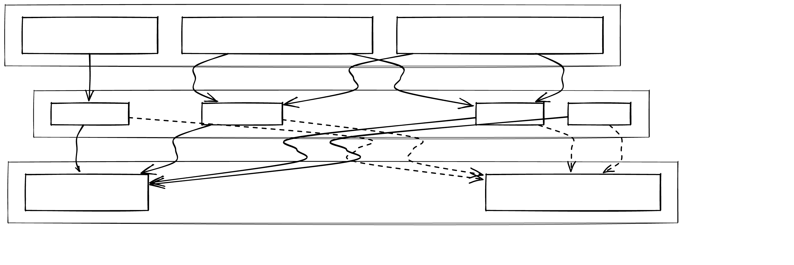

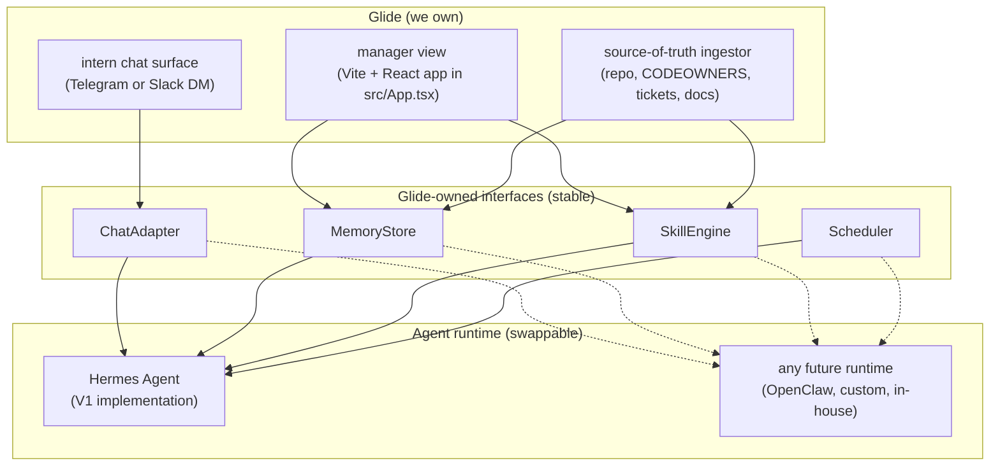

The dotted lines are the swap path. If we replace Hermes with OpenClaw or a custom runtime, we re-bind the four interfaces and the surfaces above the line do not change.

### What each interface owns

- **`ChatAdapter`** sends and receives one message at a time over a chat channel scoped to one user. Concrete today: Telegram bot via Hermes's gateway. Allowlist enforced at this layer, not in the runtime.
- **`MemoryStore`** is keyed by `(tenant, user)` and exposes two slots: a profile of *who the intern is* and a profile of *what the codebase looks like for them*. Both have hard size caps to force curation. Concrete today: Hermes's `USER.md` (1,375 chars) and `MEMORY.md` (2,200 chars). Glide treats those byte limits as the contract; if we swap runtimes we keep the caps.
- **`SkillEngine`** runs callable units: "file an access ticket", "find the owner of `service-x`", "summarise the day's PRs the intern touched". Concrete today: Hermes's built-in skill loader plus the self-improvement loop that crystallises repeated workflows into new skills. We require the engine to expose a state-machine (active / stale / archive) so skills do not bloat.
- **`Scheduler`** runs cron-like jobs: nightly re-index, daily friction digest to the manager. Concrete today: Hermes's cron loader.

The surfaces (intern chat, manager view, ingestor) only call the interface names. They never import Hermes-specific types.

## Two-surface flow

The two surfaces consume the same agent through different doors.

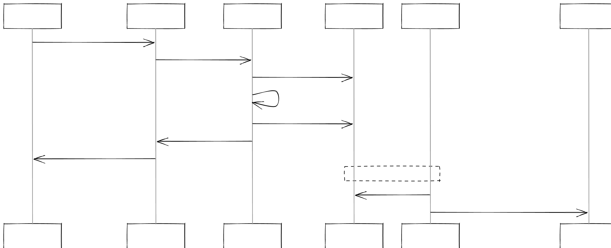

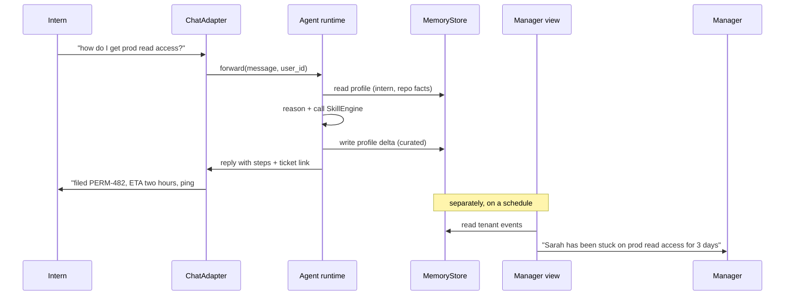

The intern sees a conversation. The manager sees a feed sourced from the *same* memory + skill calls. No second model, no second integration. The manager view never talks to the LLM directly.

## Memory + skill lifecycle (the part that grows with you)

Two ideas pulled from `docs/reference/transcript-networkchuck-hermes-review.md`. We adopt both as Glide-owned contracts; Hermes happens to implement them today.

### Memory: hard caps force curation

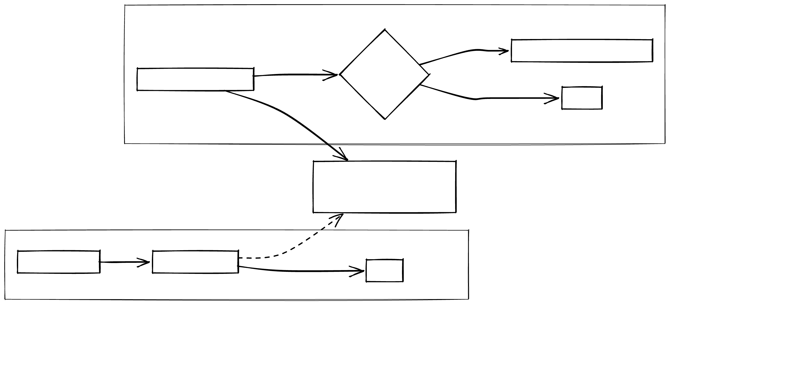

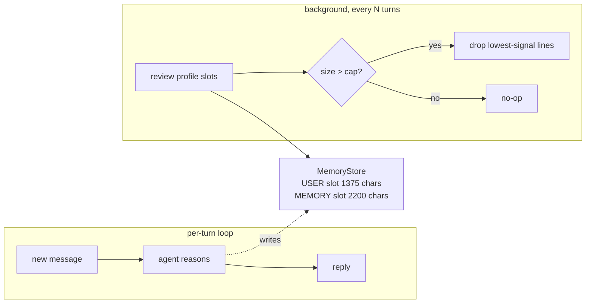

Why the caps matter: the slots are loaded into the system prompt on every turn. Unbounded memory becomes bloated context, which makes the agent dumber over time. Hermes hit this lesson the hard way against OpenClaw. We adopt the conclusion.

### Skills: self-improving, three-state lifecycle

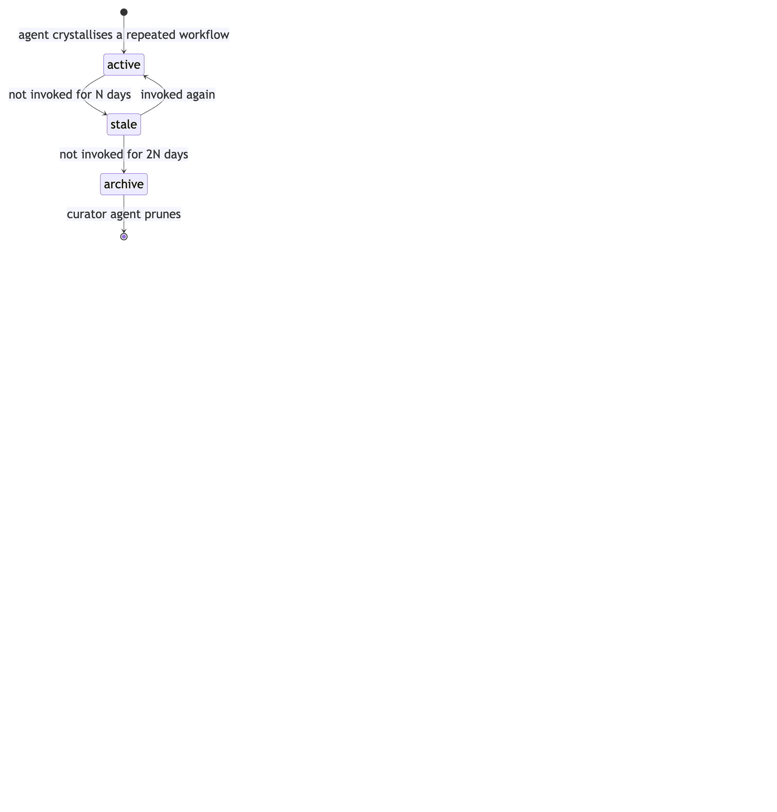

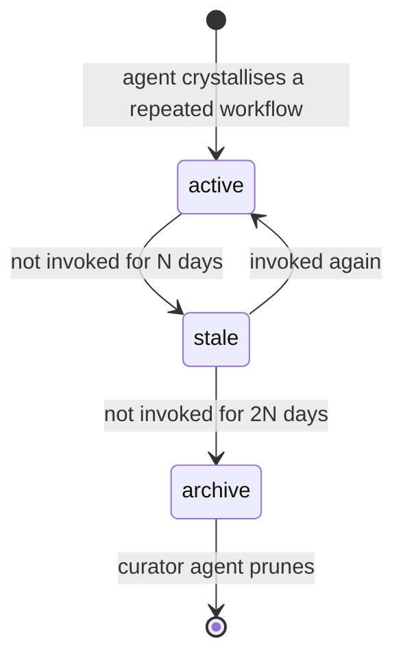

The agent watches itself solve "how do I get X access" three times, crystallises it into an `access-ticket` skill. The skill stays `active` while it gets called; it goes `stale` if it stops being used (maybe the access workflow changed); it gets `archive`d after a longer idle. A background curator agent prunes the archive set. Hermes ships a Curator today. If we swap runtimes, the `SkillEngine` interface requires the same state machine.

This is what "better on day 30 than day one" actually means.

## Multi-tool orchestration (MCP context diary)

When the SkillEngine calls multiple MCP endpoints in one turn, the naive approach — keep all tool schemas and all results in context — blows up the memory slot fast. The fix is three separate structures for three separate problems.

### Problem 1: Tool discovery (static schema)

Use a **trie / prefix-compressed table**. Skill names share prefixes naturally:

```
permissions:  file(service) check(user,service) status(ticket_id)
who-owns:     repo(name) service(name) channel(name)
repo:         diff(pr) summary(branch) owners(path)
```

A flat list of 8 skills costs ~200 tokens. Prefix-grouped costs ~60. This is what goes in the `MemoryStore` `MEMORY` slot as the static schema — it never changes within a session.

### Problem 2: Orchestration state (dynamic)

Use an **append-only log with aggressive summarization** — not the raw tool responses, only the fields the next step actually needs:

```
[1] permissions.check(sarah, prod-read) → blocked, ticket=PERM-482
[2] permissions.file(prod-read)         → ticket=PERM-483 eta=2h
[3] who-owns.service(payments)          → owner=@infra-on-call
```

Rules:
- One line per call
- Never store the full response — only the keys that feed the next call
- Truncate to the last N calls as the log grows

This fits inside the per-turn memory write in the existing loop diagram. The agent writes the one-line summary, not the raw JSON.

### Problem 3: Knowing what to call next

Use a **DAG** encoded as a small adjacency list. For Glide the DAG is mostly fixed:

```
permissions.check → permissions.file → permissions.status
who-owns.repo     → who-owns.service
```

The LLM reads the DAG to know valid next steps without reasoning from scratch every turn. Encode it once in the system prompt alongside the trie.

### Combined pattern in context

```
# Skill schema (trie, static, ~60 tokens — MEMORY slot)
permissions: check(user,svc) file(svc) status(ticket)
who-owns:    repo(name) service(name)

# Call log (append-only, rolling, ~10 tokens/step — written per turn)
[1] permissions.check(sarah, prod-read) → blocked PERM-482
[2] permissions.file(prod-read)         → PERM-483 eta=2h

# Working set (rewritten every step, ~20 tokens — USER slot delta)
user=sarah blocker=PERM-483 eta=2h
```

The working set gets rewritten each step. The log is truncated to the last N calls. The schema never changes mid-session. Together these fit comfortably inside the existing MemoryStore size caps (USER 1375 chars, MEMORY 2200 chars).

### When this matters

Not needed in V1 (Hermes handles single-skill calls fine). Build this when:
- A single onboarding turn requires 3+ sequential skill calls
- The agent is losing track of what it filed two steps ago
- The MEMORY slot is consistently hitting the 2200 char cap


Today: one container per Glide instance. Tomorrow: one per design-partner company. The Docker boundary is the isolation unit.

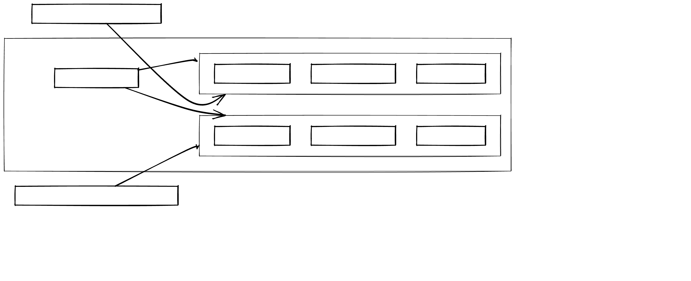

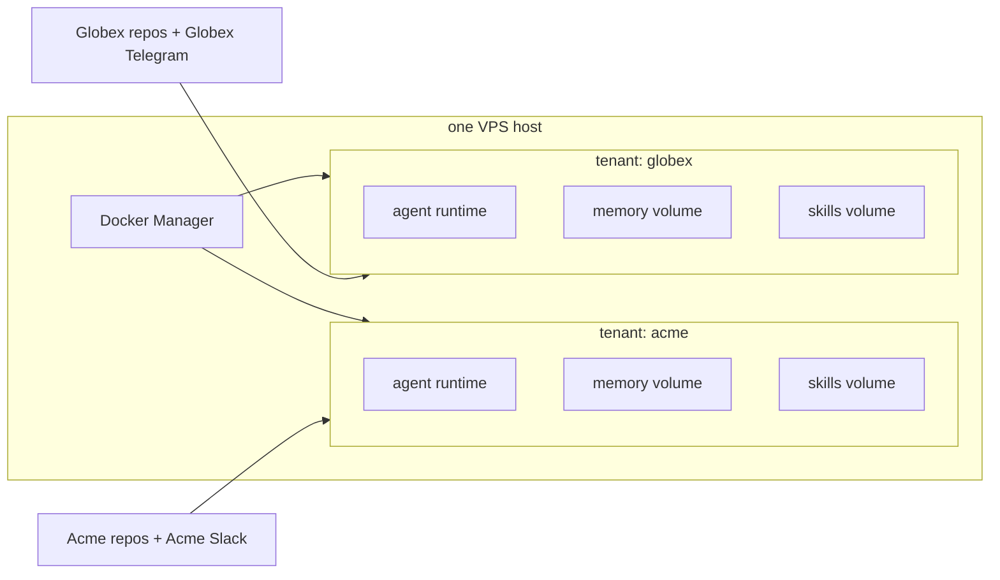

Each tenant container has:
- Its own ChatAdapter credentials (separate bot token, separate allowlist)
- Its own LLM API key with its own monthly cap
- Its own GitHub PAT scoped to that tenant's repo
- Its own memory + skills volume (so a skill crystallised for Acme never leaks to Globex)

The "agent as a new employee" pattern from `docs/reference/transcript-hermes-install-tutorial.md` is enforced *per tenant*, not per Glide deployment.

## Source-of-truth ingestion

The agent is only as useful as the inputs it sees. The ingestor is a Glide-owned cron job; the runtime never crawls anything directly.

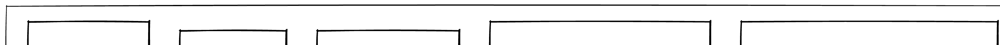

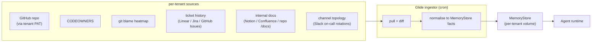

The ingestor writes *facts*, not summaries. The agent reads facts at reasoning time and produces the natural-language reply. This split keeps Glide's logic out of the runtime; the runtime stays generic.

## What Hermes gives us in V1 (and what would change on swap)

| Glide interface | Hermes V1 implementation | Swap path |
| --- | --- | --- |
| `ChatAdapter` | Hermes Telegram gateway, allowlist file | Re-implement against Slack bot API or a different runtime's chat layer. ~1 day of work. |
| `MemoryStore` | `~/.hermes/memories/USER.md` + `MEMORY.md` with hard caps, in-session curation every ~10 turns | Move to a SQLite or Postgres-backed store with the same caps as a contract. Ingestor logic does not change. |
| `SkillEngine` | Hermes skill loader, built-in skill library, self-improvement loop, Curator | Run skills as Glide-owned Python or TypeScript modules. Lose the auto-crystallisation in V1 of the swap; re-add later. |
| `Scheduler` | Hermes cron loader, daily commit-to-private-repo backup | Use the host's cron or a Glide-owned scheduler. |
| Web dashboard backend | Hermes web UI on `:8080`, sessions / skills / Kanban | Build Glide's own HTTP API; the React app already in `src/` consumes it. |

The cost of swapping is roughly *one rewrite of the ChatAdapter and one of the SkillEngine*. Memory and Scheduler are commodity. The manager view (the React app) is fully on the Glide side and does not change.

## Out of scope for the architecture

Worth naming so we do not drift into them:

- **A second LLM provider per tenant.** One LLM per tenant container, one cap. The agent decides which model based on task complexity, but the credential is one.
- **A skill marketplace.** Hermes deliberately avoids one (the OpenClaw "Claude Hub" malware lesson). Glide does the same. Skills come from the built-in library plus the agent's own crystallisation. No third-party uploads.
- **3D / R3F / canvas-heavy visualisation in the manager view.** `docs/inspiration.md` already rules this out for the landing page. Same rule for the dashboard.
- **Subscription LLM auth in production.** OpenAI Codex / Anthropic subscription works for dev. Production needs API keys with monthly caps. Hermes's web dashboard task runner enforces this and we keep that constraint.

## Pointers

- Install + first-run path: [getting-started.md](getting-started.md)
- Two transcripts behind this doc:
  - [reference/transcript-hermes-install-tutorial.md](reference/transcript-hermes-install-tutorial.md) — the security and install pattern (separate creds, allowlist, cron backup)
  - [reference/transcript-networkchuck-hermes-review.md](reference/transcript-networkchuck-hermes-review.md) — the memory + skills philosophy (size caps, self-improvement loop, curator)
- Visual direction (calm, disciplined, one accent): [visual-direction.md](visual-direction.md) and [inspiration.md](inspiration.md)
- Full MVP spec lives in Obsidian: `Projects/Onboarding as a Service - MVP Spec.md`
